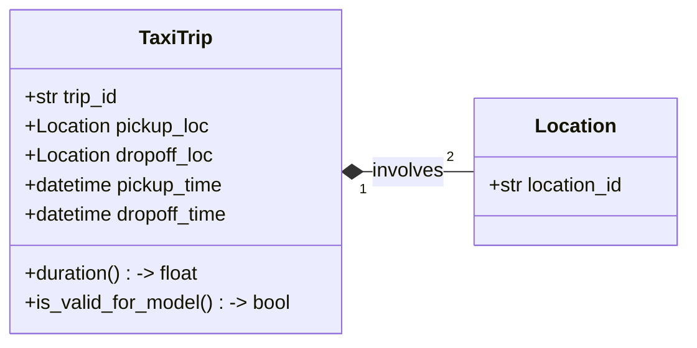

# 🚕 NYC Taxi Duration Prediction: Hexagonal MLOps Pipeline

[](https://www.linkedin.com/in/ali-ahmed-nour/)
[](https://wa.me/201007871314)
[](tel:+201288061914)

[](https://www.python.org/)
[](https://en.wikipedia.org/wiki/Hexagonal_architecture)
[](https://pola.rs/)
[](https://github.com/astral-sh/uv)

A production-ready MLOps project that predicts NYC taxi trip durations by transitioning from exploratory notebooks to a robust, cloud-agnostic pipeline—emphasizing **software architecture**, maintainability, and engineering rigor over ad-hoc scripting.

## 🎯 Business Problem & Technical Vision

Accurate trip duration prediction is essential for urban mobility platforms. It directly enhances:

- Rider experience through reliable ETAs
- Fleet dispatch efficiency
- Dynamic pricing and fare estimation

This project uses public **NYC Taxi & Limousine Commission (TLC)** data to build a high-performance ML system grounded in **Domain-Driven Design** and **Hexagonal Architecture**. The core logic is completely decoupled from infrastructure concerns (e.g., storage, tracking), ensuring testability, portability, and long-term maintainability.

### 🧠 Core Domain Model

Pure, framework-agnostic Python entities encapsulate business rules:



## 🏗️ Architecture & Project Structure

### Engineering Principles

- **Hexagonal Architecture**: Core ML logic is isolated from external systems (storage, MLflow, etc.).
- **Infrastructure Agnostic**: The core logic doesn't care if data comes from a local Parquet file, an S3 bucket, or a SQL database. Similarly, it treats MLflow as just one possible implementation of a Tracking Port.
- **High-Performance I/O**: Built on **Polars**—a Rust-based DataFrame library delivering 30–50× speedups over Pandas for Parquet workloads.
- **Type Safety & Quality**: Enforced via **Pyright** (type checking) and **Ruff** (linting/formatting).
- **Reproducibility**: Managed by **uv project**, a Rust-based Python toolchain that replaces `pip`, `poetry`, and `virtualenv`.

### 📂 Directory Layout (Updated)

```text
.
├── src/
│   ├── core/
│   │   ├── domain/         # Pure entities (e.g., TaxiTrip) & Business Rules
│   │   └── application/    
│   │       ├── ports/      # Abstract interfaces (The contracts)
│   │       └── use_cases/  # Business logic orchestration (Training, Inference)
│   ├── infrastructure/     
│   │   └── repositories/   # Concrete adapters (e.g., PolarsParquetRepo)
│   └── config.py           # Single Source of Truth for settings
├── notebooks/              # Exploratory Data Analysis (EDA)
├── tests/                  # Unit & property-based tests (Pytest + FactoryBoy)
├── pyproject.toml          # uv project-compatible project metadata
└── .pre-commit-config.yaml # Automated quality gates
```

### 🌉 Layers Responsibility (Refinement)

- **Domain Layer (`src/core/domain`):** Defines the "What". Pure Python entities like `TaxiTrip` and their validation logic.
- **Application Layer (`src/core/application`):** Defines the "How". Contains **Ports** (interfaces) and **Use Cases** that coordinate data flow without knowing about the technical source.
- **Infrastructure Layer (`src/infrastructure`):** Defines the "With". Concrete implementations like reading Parquet via **Polars** or experiment tracking with **MLflow**.

## 🛠️ Tech Stack

- **Environment & Package Management:** `uv project` (Rust-based toolchain).
- **Data Engine:** `Polars` (High-performance DataFrame library).
- **Quality Assurance:** `Ruff` (Linting), `Pyright` (Static Typing), `Pytest` (Testing).
- **Domain Simulation:** `FactoryBoy` & `Hypothesis` (for robust testing).
- **Experiment Tracking:** `MLflow` (Planned).

______________________________________________________________________

## ⚙️ Environment, Workflow & Getting Started

### 🔧 Configuration via `.env`

| Variable | Default | Description |
|-----------------|-----------------------|---------------------------------|
| `ENV` | `local` | Environment (`local`, `dev`, `prod`) |
| `DATA_PATH` | `./data` | Root path for Parquet datasets |
| `TRACKING_URI` | `http://localhost:5000` | MLflow tracking server URI |

### 🔄 Development Workflow

1. **Research**: Prototype in `notebooks/`.
1. **Refactor**: Move stable logic to `src/core/domain/`.
1. **Implement Adapters**: Write infrastructure bindings in `src/infrastructure/`.
1. **Validate**: All changes must pass `pre-commit` hooks.

### 🚀 Quick Start

```bash
# Install uv project (Rust-based Python toolchain)
curl -LsSf https://astral.sh/uv project/install.sh | sh

# Clone and set up
git clone https://github.com/your-username/nyc-taxi-mlops-hexagon.git
cd nyc-taxi-mlops-hexagon
uv project sync

# Run quality gates
uv project run ruff check .
uv project run pyright .
uv project run pytest
```

> [!IMPORTANT]\\
>
> > **Currently Under Construction**: I am actively building and refactoring this project to achieve full Hexagonal maturity. APIs and internal structures are evolving rapidly. Contributions and feedback are welcome!
